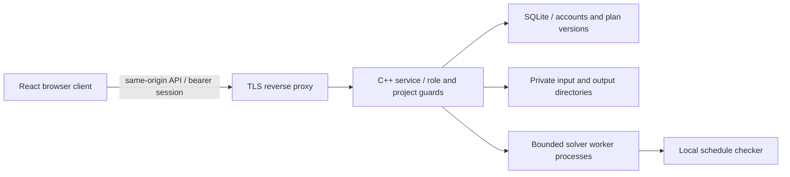

# Interface and security review — 19 September 2026

## Implemented changes

The active React client now uses one paper background (#f5f3ed) and charcoal ink (#302c27), Work Sans Regular, large headings, plain controls, and horizontal rules. The old automatic blue/dark workspace override is removed. A matching warm-charcoal dark theme and a device-following option replace it. All inputs, including those without a type attribute, use the same style.

Schedules now have table and timeline views, project/search/week/access/coordinator filters, contract/person grouping, explicit plan-version selection, sortable columns, and bounded pages. A timeline row represents one activity. Grouping by coordinator no longer overwrites simultaneous activities in one week. Standard and ECLO slots use muted colours plus text/pattern cues; the view does not imply continuous possession. Grouping projects is not a cross-project conflict check.

The activity dialog traps keyboard focus, restores focus on close, and refreshes assignments after a save. Coordinator changes render optimistically and roll back on failure. Accounts use an accessible disclosure with ordinary tab navigation. The existing role-based API remains authoritative. No browser-only permission grant was added.

The API client now isolates cached data and pending requests by login session. A session change cancels old requests, including queued requests. Old results cannot refill the cache. Requests have deadlines, bounded concurrency, and an entry-bounded immutable cache. Independent consumers cannot cancel each other's requests. A 401 clears local account state. No mutation is automatically retried, because the service does not provide durable idempotency keys.

The service now sends private/no-store API headers, rejects cross-site browser writes, limits POST requests by remote IP, limits credential size before password hashing, serializes initial administrator creation, uses cryptographic random IDs, and returns a generic exception response. Existing session expiry, prepared statements, project guards, worker limits, and role checks remain. The limiter is process-local; it is not a distributed or per-tenant quota system. Proxies must preserve Host. Forwarded client-IP headers are not trusted.

## Architecture decision

Keep the existing solver and data store. Replace presentation and repair verified boundary defects. Do not rewrite the solver or migrate identity/storage while claiming a visual change is complete. The legacy `web/` folder is not the redesigned application: serve `web-dist/` after building `client/`.

## Remaining production requirements

These are explicit gaps, not implemented controls. Earlier documents that describe them as plans are not evidence of delivery.

| Requirement | Current evidence and remaining work |
| --- | --- |
| Authentication and session expiry | Local password accounts and server-side idle/absolute expiry exist. Firebase integration and email recovery are absent. Browser bearer tokens remain accessible to same-origin JavaScript; migrate to a reviewed cookie or Firebase gateway design. |
| Authorization and tenancy | Owner/project guards and role checks exist. Administrators and approvers can see all projects in this installation. This is one organization, not isolated multi-tenant hosting. Use separate installations until tenant membership is enforced throughout storage and APIs. |
| Input and injection protection | Native CSV validation, prepared SQL, React text escaping, upload caps, and controlled worker arguments exist. No unrestricted HTML rendering was introduced. Continue fuzzing parsers and validating all identifier/date ranges. |
| Abuse prevention | Bounded queues/workers, per-account login failures, and new per-IP POST budget. Add distributed edge limits, trusted proxy configuration, tenant budgets, and sustained attack tests before scaling. |
| TLS and secrets | Caddy configuration provides automatic TLS renewal when deployed with a real domain. Certificate rotation/expiry monitoring and deployment secret rotation are not verified locally. No service-account secret was added. |
| Audit integrity | Database audit events exist. They are not tamper-evident against a privileged database editor. Add cryptographic chaining plus independently protected checkpoints/immutable storage and verification drills. |
| PII and retention | Account names, password hashes, assignments, photos, and project files persist. Automated retention, deletion/export requests, backup expiration, and legal basis are not complete. Avoid collecting unnecessary personal information. |
| Compliance and terms | Separate terms/privacy/cookies pages and an explicit browser agreement choice exist. No regulatory certification is claimed. Versioned server-enforced acceptance and operator/jurisdiction-specific legal review remain. |
| Retries, idempotency, resilience | Client cancellation/deadlines and bounded workers are implemented. Mutation retry is intentionally manual. Durable idempotency, durable job queue recovery, circuit breakers, and distributed concurrency still require implementation. |
| Accessibility | Keyboard/dialog changes and automated browser scans are testable. Manual screen-reader review, all-browser and physical-device checks remain separate release checks. |
| Recovery | `scripts/backup_store.py` copies and verifies an offline store plus artifacts, and refuses overwrite on restore. Stop the service before use. Encrypt backups externally and test deployment restoration. Proposed RTO 4 hours / RPO 24 hours are targets, not achieved SLAs. |
| Testing and CI | Native tests remain. React transport/model coverage and real-service browser tests are added. CI definitions are written; remote execution and branch protection require repository configuration. Coverage numbers apply only to the named tested modules, not the whole app. |
| Load and chaos | Existing integration checks exercise bounded concurrent work and worker termination. They do not establish production load capacity or recovery SLAs. Run deployment-scale load, stress, dependency outage, disk-full and restore drills before public operational use. |

## Review and release standards

Run native tests, integration tests, `npm run check`, browser tests, and dependency audit before merging. Review changes to authorization, solver rules, schema migrations, and retention with a second person. Require passing checks and protected branches in the repository settings. Do not weaken a test or change rule semantics to improve the visual demo.

Use short instructions and consistent terms in the UI. The language follows Simplified Technical English principles. It is not certified ASD-STE100 compliance.

## Recovery procedure

1. Stop the service. Confirm no worker can write files.
2. Run `python3 scripts/backup_store.py backup /path/to/store --destination /secure/new-backup --service-stopped`.
3. Run `python3 scripts/backup_store.py verify /secure/new-backup`.
4. Encrypt and copy the backup to restricted storage outside the service host. Set a retention policy.
5. For a drill, restore to a new directory with `restore SOURCE --destination NEW --service-stopped`.
6. Start an isolated service against the restored directory. Check accounts, project files, approvals, and exports.
7. Measure recovery time and data age. Record results before claiming RTO/RPO.

The manifest detects accidental corruption. An attacker who can rewrite both files and manifest can defeat it. It is not an independently anchored audit log.

## Latest refinement pass

See the root `readupdate.md` for personal overview, mobile navigation, warm dark theme, keyset project pagination, public metadata configuration, and the remaining deployment tasks. The offline restoration drill passed for database data and plan artifacts, including corruption and overwrite checks.
